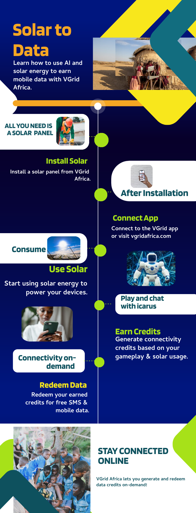

# PROJECT TITLE: ICARUS AI 
# Portfolio: https://www.f6s.com/vgrid
# Providing Connectivity using Carbon offsetting Virtual Solar Grid
](https://m.youtube.com/watch?v=3a4Mqn75fg0)
# About
An AI Assistant that helps users in underserved regions to obtain IoT solar units and connect to our gamified carbon offsetting Virtual grid to track their GHG offsets and earn connectivity credits in form of SMS, Voice & Data microbundles. 
This model is tailored to cater the rising adoption of solar energy in southern Africa which has been hit with a 1200MW drought induced Hydropower deficits

# Overview
ICARUS AI Bot is designed to abstract away from the complexities of vgridafrica.com photovoltaic based carbon offsetting model that computes carbon credits based on GHG emissions avoided by using solar energy to provide connectivity on demand in form of Data & SMS or voice. 
The goal is to incentivise sustainable living and digital inclusion in off-grid communities while disrupting the $1.5Trillion Carbon markets.

# Application Live Demo 
- Visit https://vgridafrica.com
- launch ICARUS on the bottom right corner.
- Dont forget to turn off the candlelight on bottom left of screen.
- Follow instructions from ICARUS.

# Features
- Multimodal Voice chatbot assistant for onboarding & engagement
- Visualizer Map for solar nodes in the world 
- iCARUS can compute solar power output for each user
- Compute carbon offsets in real time for each user
- Read out Gamified leaderboard
- Manage users Carbon Wallet to redeem goodies

## Knowledge Base
This project utilizes the following datasets:
- VGrid Solar Maps & webscraping
- Global Electricity Grid Dataset (World Bank)
- NASA Infrared World Map
- Giga Schools Connectivity Dataset
- Ooni Observatory to test connectivity in any mobile network
  
# How it works

## Technical Requirements
- PHP 7.x
- AI/ML 
- MySQL 8.x
- WordPress 5.x (optional)
- Required extensions:

# Installation
_Prerequisites_
- Install WordPress (if using as a WordPress plugin)
- Any Chatbot functionality with AI API support.

##_Steps_
1. Clone the repository: `git clone https://github.com/kayden36/icarus-ai.git`
2. Install dependencies: `composer install`
3. Configure environment variables: 

## API Integration
To integrate the VGrid chatbot into your website, follow these steps:

1. Obtain an API key by contacting us at founder@vgridafrica.com 
2. Configure chatbot using botsettngs.yaml
3. Connect icarus AI plugin with your API Key

# Usage
1.  Access the web application through your web browser
2. Follow icarus instructions to connect to the VGrid system
3. Engage with the chatbot to track your solar usage and earn credits
4. Redeem your credits for digital services

## Contributing
Contributions are welcome! Please submit a pull request.

## License
This project is licensed under MIT.

## Acknowledgments
Special thanks to Aliya-Ali for Contribution.

### Contact
Email: founder@vgridafrica.com 
