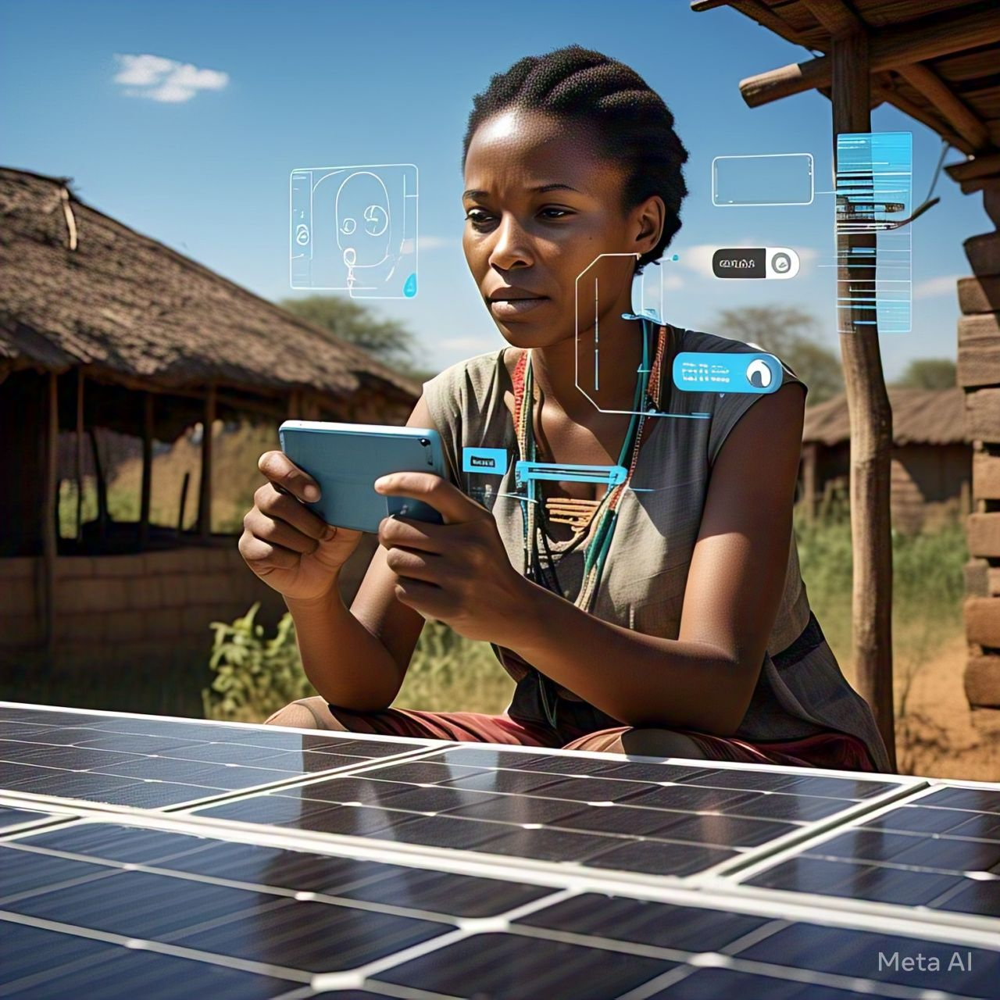

# PROJECT TITLE: Vgrid Intelligent Solar Network
]
## Transforming solar nodes into an intelligent solar network grid by embedding AI agents directly in communities to bridge the connectivity gap in offgrid and rural areas 
](https://m.youtube.com/watch?v=3a4Mqn75fg0)
# About
ICARUS is not just an AI Agent, it's an AI orchestrator abstracting complex inbuilt precision microservices & regulatory bureaucracy to provide easy guidance for users in underserved areas to access solar power, track their carbon offsets and earn connectivity credits in form of SMS, Voice & Data microbundles. 
## Overview 
]This model is tailored to cater the rising adoption of solar energy in southern Africa which has been hit with a 1200MW drought induced Hydropower deficits. ICARUS AI Bot is designed to run on vgrid & abstract users away from the complexities of photovoltaic based carbon offsetting model, carbon credits & GHG emissions avoided by using solar energy by simply carbon offsets into connectivity credits to provide connectivity on demand in form of Data, SMS or Voice. 
The goal is to incentivise sustainable living and digital inclusion in off-grid communities while disrupting the $1.5Billion Carbon markets.
# Application Live Demo 
- Visit https://vgridafrica.com
- launch ICARUS on the bottom right corner
- Follow instructions from ICARUS.
# Features
- Multimodal Text & Voice AI chatbot assistant for onboarding and continuous engagement 
- Redeem free SMS & Data Bundles Instantly
- Visualizer Map for solar nodes in the world 
- Dynamic Gamified leaderboard
## iCARUS AI - Enhanced Contextual Realtime Awareness, Adaptability & Precision
ICARUS AI is able to deliver high precision data and insights using JavaScript Drones (microservices wrapped in gutenberg blocks), each dedicated to fetch Real-Time Precise ACF data optimizing & enhancing prompts for ICARUS in the following ways:
- Tracking solar node performance
- Monitoring live offsets
- Managing rewards balances
- Handling user requests and inquiries
 
## Knowledge Base
This project utilizes the following datasets:
- Metadata Analysis & Feedback login
- Inbuilt Javascript Microservices
- VGrid Solar Maps & webscraping
- Global Electricity Grid Dataset (World Bank)
- NASA Infrared Night Lights Satellite Datasets
- Giga Schools Connectivity Dataset
- Ooni: To test connectivity in any mobile network
  
# How it works

## Technical Requirements
- PHP 7.x
- Gemini Flash Pro
- AI/ML 
- MySQL 8.x
- WordPress 5.x (optional)
- Required extensions 

## Easy Installation 
_Prerequisites_
- Install WordPress (if using ICARUS as a WordPress plugin)
- Any Chatbot functionality with AI API support.

##_Steps_
1. Clone the repository: `git clone https://github.com/kayden36/icarus-ai.git`
2. Install dependencies: `composer install`
3. Configure environment variables (env.YAML]: 
4. API Integration - To integrate the Chatbot into your website, follow these steps:
1. Obtain an API key by contacting us at founder@vgridafrica.com 
2. Configure chatbot using botsettngs.yaml
3. Connect ICARUS to your chatbot plugin with your API Key

# Usage
1.  Solar Power Installation Guide
2.  Learn about Carbon Offsetting & Footprinting
3.  Earn Connectivity like SMS & Data on demand
4.  Geospatial Solar Data Analysis
5.  Get Data driven insights, business intelligence, Sustainability & Connectivity 

## Contributing
Contributions are welcome! Please submit a pull request.

## License
This project is licensed under MIT with NDA clause.

## Acknowledgments
Special thanks to Aliya-Ali for Contribution.

### Contact
Konrad Malilwe
- Email: founder@vgridafrica.com 
- Portfolio: https://www.f6s.com/vgrid
