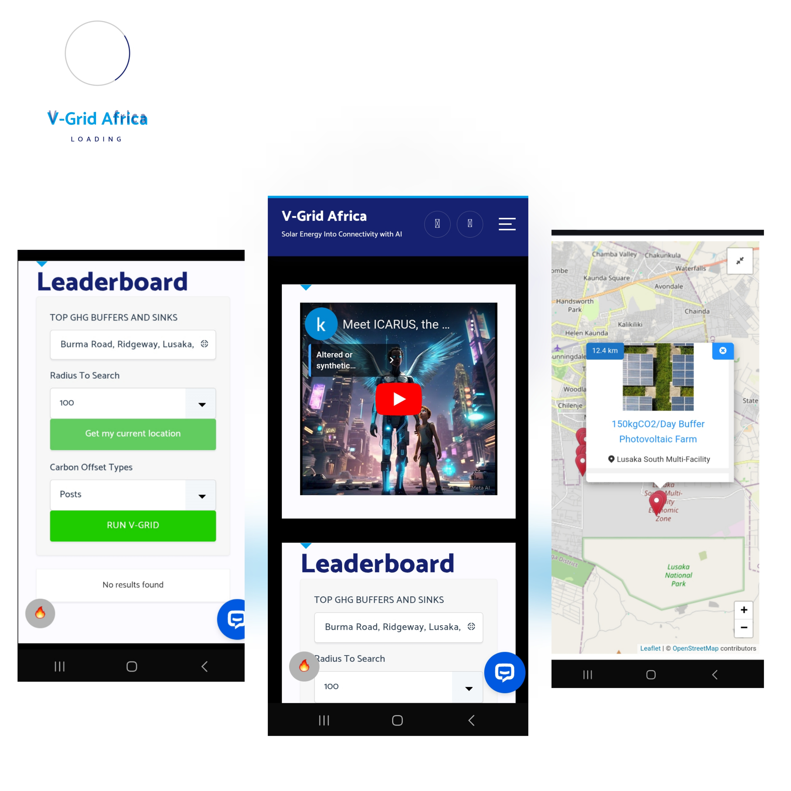

# PROJECT TITLE: ICARUS AI 
### Portfolio: https://www.f6s.com/vgrid
]
## AI driven Connectivity using Carbon offsetting Virtual Solar Grid
](https://m.youtube.com/watch?v=3a4Mqn75fg0)
# About
ICARUS is not just an AI Agent, it's an AI orchestrator abstracting complex inbuilt precision microservices & regulatory bureaucracy to provide easy guidance for users in underserved areas to access solar power, track their carbon offsets and earn connectivity credits in form of SMS, Voice & Data microbundles. 
This model is tailored to cater the rising adoption of solar energy in southern Africa which has been hit with a 1200MW drought induced Hydropower deficits

# Overview
ICARUS AI Bot is designed to abstract away from the complexities of vgridafrica.com photovoltaic based carbon offsetting model which computes carbon credits based on GHG emissions avoided by using solar energy. ICARUS tokenises carbon offsets to provide connectivity on demand in form of Data, SMS or Voice. 
The goal is to incentivise sustainable living and digital inclusion in off-grid communities while disrupting the $1.5Billion Carbon markets.

# Application Live Demo 
- Visit https://vgridafrica.com
- launch ICARUS on the bottom right corner
- Follow instructions from ICARUS.

# Features
- Multimodal Text & Voice AI chatbot assistant for onboarding and continuous engagement 
- Redeem free SMS & Data Bundles Instantly
- Visualizer Map for solar nodes in the world 
- Dynamic Gamified leaderboard
# AI WITH JS. PRECISION
ICARUS AI is able to deliver high precision data and insights using JavaScript Drones, each dedicated to Real-Time Precision microservices optimizing ICARUS for the following capabilities:
- Tracking solar node performance
- Monitoring live offsets
- Managing rewards balances
- Handling user requests and inquiries
 
## Knowledge Base
This project utilizes the following datasets:
- Inbuilt Javascript Microservices
- VGrid Solar Maps & webscraping
- Global Electricity Grid Dataset (World Bank)
- NASA Infrared World Map
- Giga Schools Connectivity Dataset
- Ooni Observatory to test connectivity in any mobile network
  
# How it works

## Technical Requirements
- PHP 7.x
- AI/ML 
- MySQL 8.x
- WordPress 5.x (optional)
- Required extensions:

# Installation
_Prerequisites_
- Install WordPress (if using as a WordPress plugin)
- Any Chatbot functionality with AI API support.

##_Steps_
1. Clone the repository: `git clone https://github.com/kayden36/icarus-ai.git`
2. Install dependencies: `composer install`
3. Configure environment variables: 

## API Integration
To integrate the VGrid chatbot into your website, follow these steps:

1. Obtain an API key by contacting us at founder@vgridafrica.com 
2. Configure chatbot using botsettngs.yaml
3. Connect icarus AI plugin with your API Key

# Usage
1.  Personal Carbon Footprinting
2.  Emergency Connectivity on demand
3.  Geospatial Analysis
4.  Data driven insights 

## Contributing
Contributions are welcome! Please submit a pull request.

## License
This project is licensed under MIT.

## Acknowledgments
Special thanks to Aliya-Ali for Contribution.

### Contact
Email: founder@vgridafrica.com 
